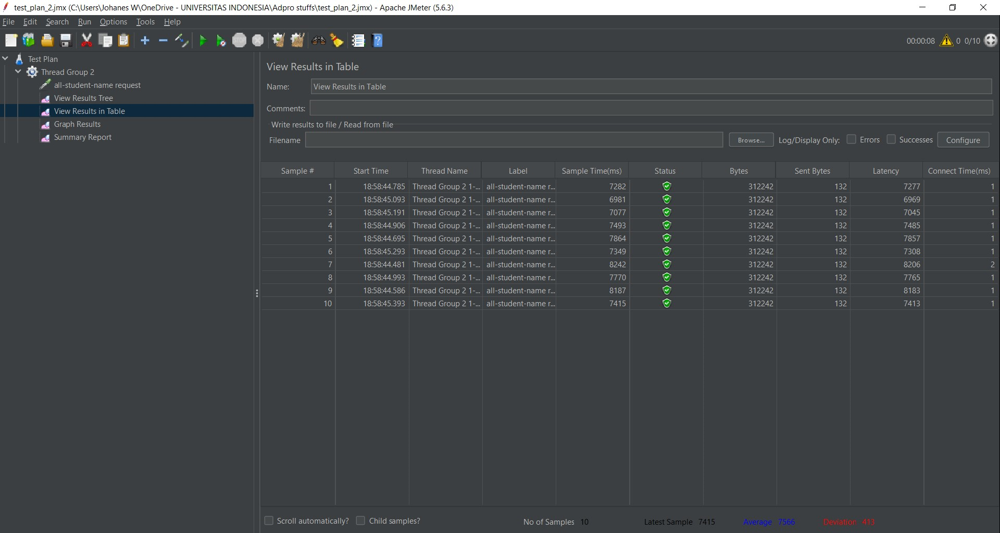
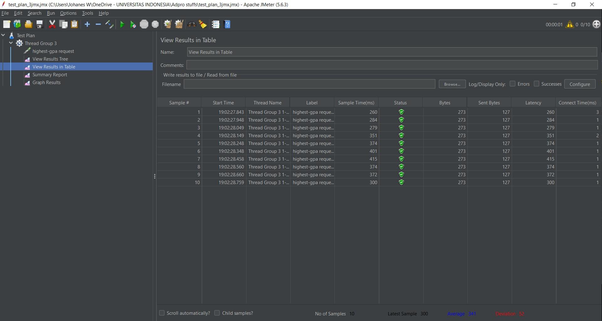
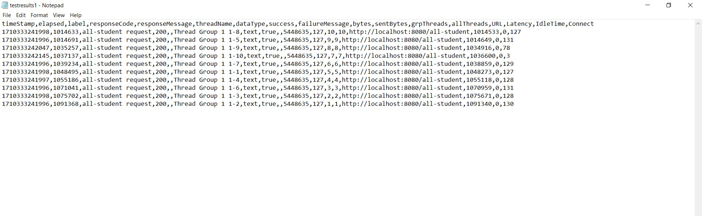
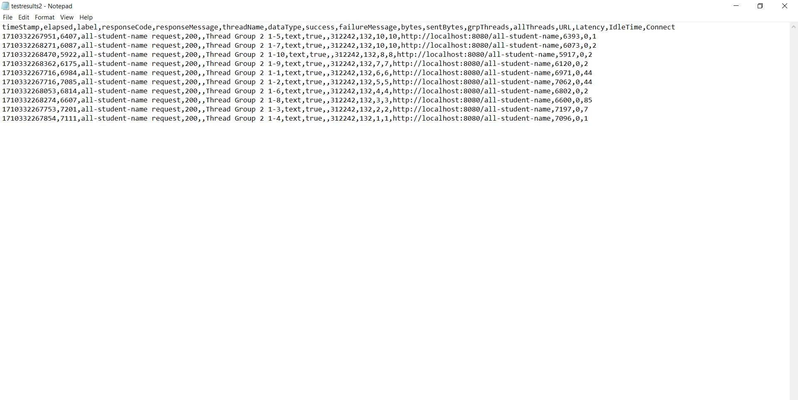
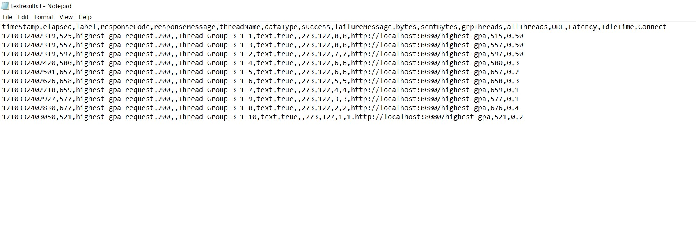
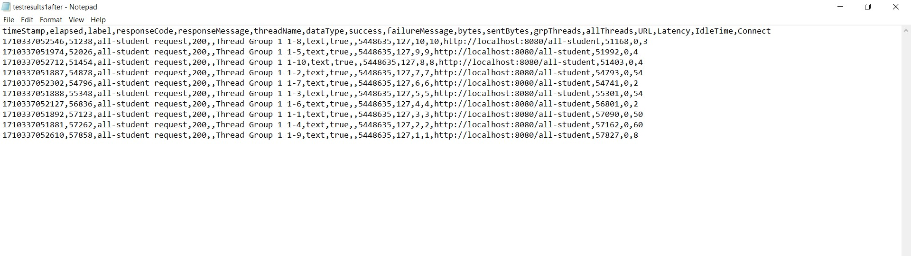
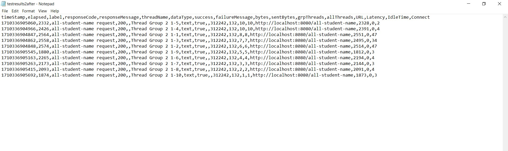
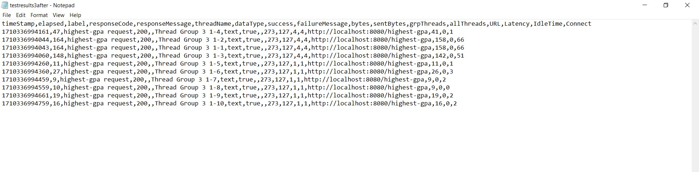

Johanes W / 2206032425 / Adpro-A

screenshots of 2 JMeter test plans and their execution through the GUI for the endpoints /all-student-name and /highest-gpa

/all-student-name:

/highest-gpa:

screenshots of the execution results of the JMeter test plan through the command line for the endpoints /all-student-name and /highest-gpa
/all-student:

/all-student-name: 

/highest-gpa:

There are screenshots of the re-measurement through JMeter after performance optimization along with conclusions/explanations

/all-student:

/all-student-name:

/highest-gpa: 

Dapat disimpulkan bahwa proses refactoring atau optimisasi pada bagian code tertentu (yang menyebabkan bottleneck)
dapat meningkatkan performa untuk endpoints yang berhubungan. 

Reflections:

1. Pendekatan pengujian kinerja dengan JMeter fokus pada simulasi beban tinggi dan pengukuran respons waktu aplikasi. Sementara itu, profiler IntelliJ berfokus pada analisis kedalam kode untuk mengidentifikasi titik lemah dan memahami perilaku aplikasi secara mendalam
2. Dengan menganalisis perilaku kode secara mendalam. Dengan memahami bagaimana aplikasi berinteraksi dengan sumber daya, profiler membantu fokus pada perbaikan yang dapat meningkatkan kinerja secara efektif.
3. Ya, karena CPU time, perilaku kode, dll dianalisis secara informatif.
4. Membiasakan diri dengan UI jmeter
5. Kemudahan karena built-in di intellij dan informasi CPU time per methods dan memory allocation. 
6. Dites ulang karena bisa jadi kesalahan bukan karena faktor kesalahan dari proses profiling dan performance testing-nya (bisa jadi faktor lain).
7. Memahami code-nya, me-refactor dan meng-optimize agar menemukan code paling efisien, untuk memastikan tidak mengubah fungsionalitas adalah dengan memahami code saat, sebelum, dan sesudah refactor